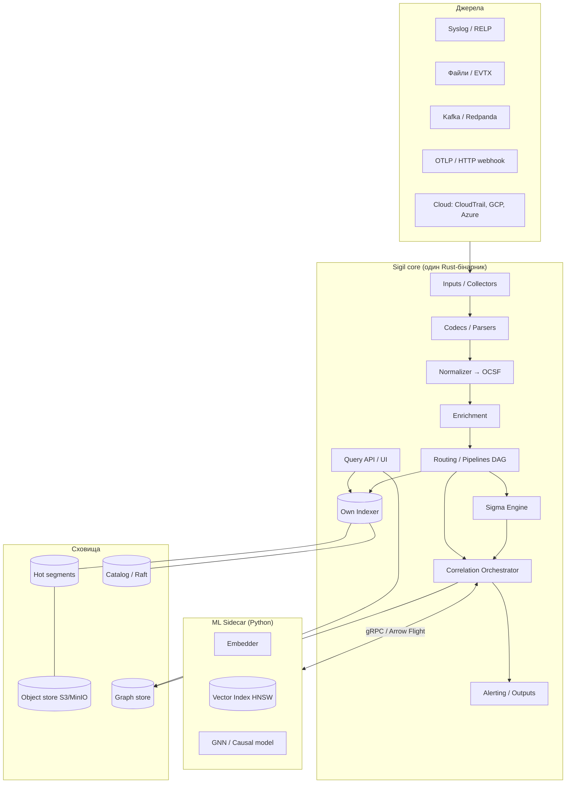
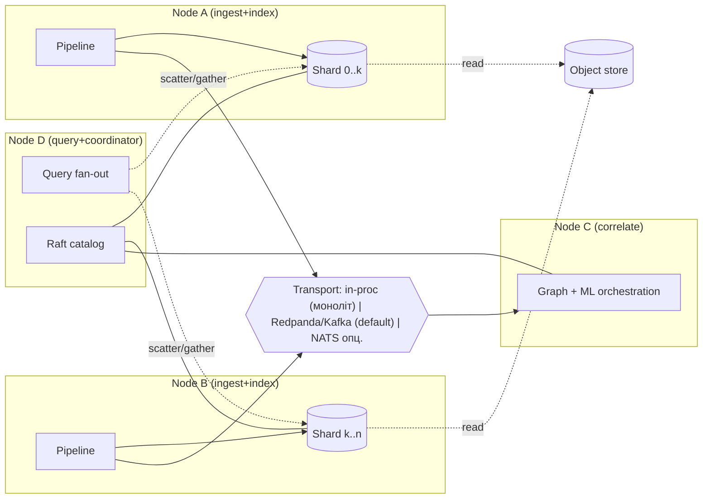
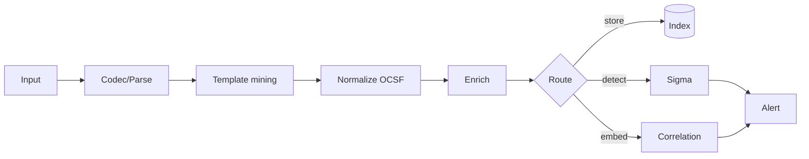
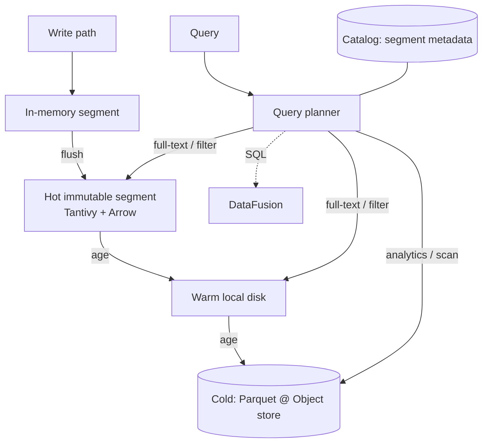
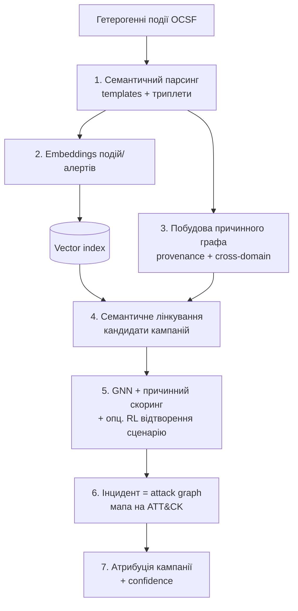
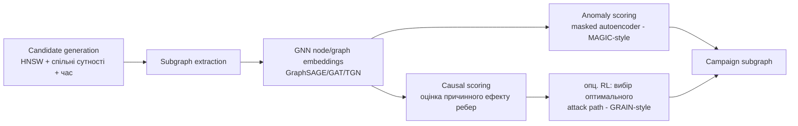
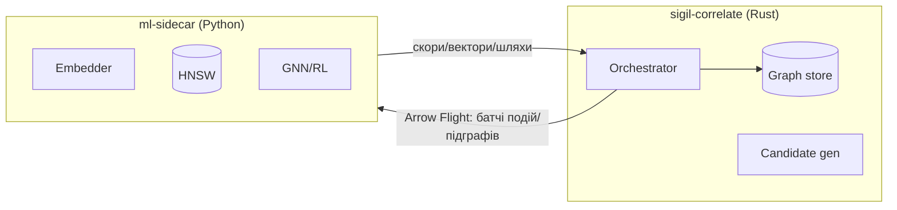
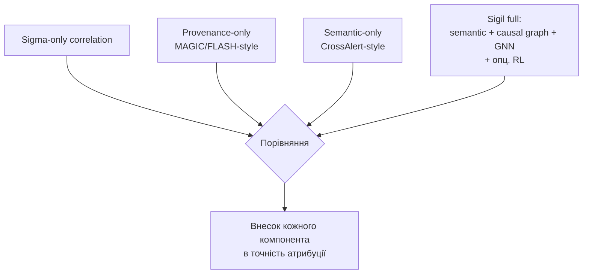
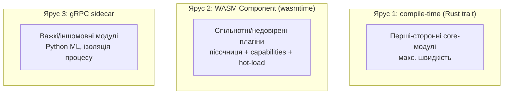

# Sigil — дизайн-документ SIEM з семантично-причинною кореляцією

> **Статус:** чернетка v0.1 для обговорення · **Тип проєкту:** open-source / портфоліо
> **Мова ядра:** Rust (моноліт) · **ML-частина:** Python-сайдкар
> **Кодова назва `Sigil`** — робоча, можна перейменувати (натяк на *Sigma* + *signal/mark*).

Це не фінальна специфікація, а **детальний опис кінцевого результату**: яким буде продукт, з яких частин складається, як працює конвеєр, як виглядає дослідницька фіча та як ми міряємо її точність. Далі ми це підкоригуємо і розіб'ємо на етапи.

---

## Зміст

1. [Бачення, цілі, межі](#1-бачення-цілі-межі)
2. [Принципи дизайну](#2-принципи-дизайну)
3. [Архітектура верхнього рівня](#3-архітектура-верхнього-рівня)
4. [Модель виконання та масштабування](#4-модель-виконання-та-масштабування)
5. [Конвеєр обробки подій (data plane)](#5-конвеєр-обробки-подій-data-plane)
6. [Модель даних та нормалізація (OCSF)](#6-модель-даних-та-нормалізація-ocsf)
7. [Власний індексер та сховище](#7-власний-індексер-та-сховище)
8. [Детектування: рушій Sigma](#8-детектування-рушій-sigma)
9. [⭐ Семантично-причинна кореляція (ключова фіча)](#9--семантично-причинна-кореляція-ключова-фіча)
10. [Дотичні роботи та позиціонування новизни](#10-дотичні-роботи-та-позиціонування-новизни)
11. [Методологія оцінки точності](#11-методологія-оцінки-точності)
12. [Система плагінів та модулів](#12-система-плагінів-та-модулів)
13. [Declarative-first конфігурація та розгортання](#13-declarative-first-конфігурація-та-розгортання)
14. [Безпека самого SIEM](#14-безпека-самого-siem)
15. [Спостережуваність та експлуатація](#15-спостережуваність-та-експлуатація)
16. [Технологічний стек](#16-технологічний-стек)
17. [Структура репозиторію](#17-структура-репозиторію)
18. [Дорожня карта](#18-дорожня-карта)
19. [Ризики та ухвалені рішення](#19-ризики-та-ухвалені-рішення)
20. [Глосарій та посилання](#20-глосарій-та-посилання)

---

## 1. Бачення, цілі, межі

**Одним реченням.** Sigil — це single-binary SIEM на Rust з власним індексером і нативним рушієм Sigma, який поверх класичного детектування додає рушій **семантично-причинної кореляції**: він зводить різнорідні (гетерогенні) події безпеки у єдиний причинно-наслідковий граф багатоетапної атаки, користуючись векторними представленнями подій і графовим навчанням, та оцінює власну точність у задачі атрибуції.

**Цілі (must-have):**

- **Моноліт, що масштабується** — один бінарник, який працює і на одному вузлі (вертикальне масштабування), і горизонтально (кілька інстансів з рольовим таргетингом і шардуванням).
- **Власний індексер** — повнотекстовий + колонковий, з гарячим/теплим/холодним рівнями та винесенням на об'єктне сховище.
- **Sigma rules** як першокласний формат детектувань, включно з кореляційними правилами нового стандарту Sigma.
- **Плагіни/модулі** — три рівні розширення (compile-time, WASM, gRPC-сайдкар) з декларативними дозволами.
- **Declarative-first** — уся система (входи, парсери, конвеєри, індекси, правила, моделі, ролі) описується наперед у версіонованому конфізі, але з можливістю ручної доконфігурації у рантаймі.
- **Семантично-причинна кореляція** + **відтворюваний експеримент** з її точності.

**Не-цілі (поки що):**

- Не EDR-агент і не сенсор на end-point (Sigil споживає телеметрію, а не збирає її з ядра ОС — для цього є зовнішні агенти/сенсори).
- Не повноцінний SOAR (оркестрація реагування — лише через output-плагіни/вебхуки на старті).
- Не претендуємо на атрибуцію до конкретних *threat actors* як на достовірний результат — це фундаментально невизначена задача (див. §9.7). Наша «атрибуція» — це (а) зведення подій в одну кампанію і (б) відтворення ланцюга технік ATT&CK.

---

## 2. Принципи дизайну

1. **Modular monolith, не distributed monolith.** Усередині — чіткі модулі з вузькими інтерфейсами; зовні — один артефакт. Розподіленість вмикається конфігом, а не переписуванням.
2. **Schema-first.** Внутрішня нормалізована схема (OCSF) — контракт між усіма модулями. Сирий лог зберігається завжди (schema-on-read як запасний шлях).
3. **Декларативність як джерело істини.** Бажаний стан описано в конфізі; рантайм узгоджується з ним (reconciliation), а ручні зміни видно як *drift*.
4. **Backpressure end-to-end.** Жоден етап не «захлинається»: тиск передається назад до входу; за потреби — спіл на диск/чергу.
5. **Дешевий «нульовий» режим.** `./sigil run` на одному ноуті має працювати без Kafka, без Kubernetes, без зовнішньої БД.
6. **ML — окремий процес.** Важкі моделі (embeddings, GNN) ізольовані у сайдкарі; ядро лишається передбачуваним і компільованим.
7. **Все вимірюється.** Кожен етап емітить метрики; дослідницька фіча має вбудований harness для оцінки.

---

## 3. Архітектура верхнього рівня



Ключова ідея: **зелений шлях (індексація + Sigma) і фіолетовий шлях (кореляція) живляться з одного нормалізованого потоку**. Кореляція ніколи не блокує гарячий шлях — вона працює асинхронно поверх того самого OCSF-потоку.

---

## 4. Модель виконання та масштабування

### 4.1 Один бінарник, кілька «таргетів»

Натхнення — модель Grafana Loki/Mimir («single binary, multiple targets»). Той самий бінарник запускається в одній із ролей (або в усіх одразу):

| Роль (target) | Відповідає за |
|---|---|
| `ingest` | прийом, парсинг, нормалізація, enrichment |
| `index` | побудова сегментів, запис у сховище, пошук |
| `correlate` | граф + оркестрація ML-кореляції |
| `query` | API/UI, fan-out пошуку по index-вузлах |
| `coordinator` | каталог, членство кластера, шардування (Raft) |

```bash
# Монолітний режим (за замовчуванням): усе в одному процесі
sigil run --config ./sigil.yaml          # target=all

# Горизонтально: різні ролі на різних вузлах
sigil run --target ingest,index
sigil run --target correlate
sigil run --target query,coordinator
```

### 4.2 Вертикальне масштабування

- **Thread-per-core** гарячий шлях (Tokio multi-thread; за потреби — `monoio`/`glommio` для критичних стадій) з work-stealing.
- **Zero-copy парсинг** (`bytes`, `simd-json`), mmap-сегменти, SIMD-фільтри.
- Налаштовувані пули воркерів на стадію + розмір батчів; backpressure через `tokio::sync::mpsc`/`flume` з обмеженими каналами.
- Більше RAM → більший page cache і більший HNSW у сайдкарі; більше CPU → більше паралельних шардів індексу.

### 4.3 Горизонтальне масштабування



- **Абстракція транспорту.** Стадії спілкуються через трейт `Transport`. У монолітному режимі це in-process канал; у розподіленому — той самий інтерфейс над Redpanda (Kafka-протокол) за замовчуванням, опційно NATS JetStream. Код стадій не змінюється.
- **Шардування** індексу за часом (партиції) + хешем (наприклад, за `host.id`/`tenant`). Реплікація з налаштовуваним фактором.
- **Спільний холодний рівень.** Усі `index/query`-вузли читають сегменти з об'єктного сховища → query-вузол відповідає на запит за будь-який сегмент незалежно від того, хто його створив.
- **Координація.** Вбудований Raft (`openraft`) тримає каталог (метадані сегментів, реєстр схем, реєстр правил, мапу шардів, членство). Зовнішній etcd — опційна альтернатива для великих кластерів.

### 4.4 Топології розгортання

1. **Single-node** (демо/малий SOC): `target=all`, локальний диск + опційний MinIO, ML-сайдкар поруч.
2. **Scale-out** (середній): кілька `ingest+index`, окремі `correlate` і `query+coordinator`, спільний S3/MinIO, шина NATS.
3. **HA**: ≥3 coordinator-вузли (Raft quorum), реплікація шардів ≥2, кілька query-вузлів за балансувальником.

---

## 5. Конвеєр обробки подій (data plane)



Кожна стадія — це трейт із реалізаціями-плагінами (див. §12). Конвеєр описується декларативно як DAG (§13).

1. **Input / Collector** — джерела: `syslog` (UDP/TCP/RELP, RFC3164/5424), `file` (tail з checkpoint), `windows_eventlog`/`evtx`, `kafka`, `http`/`webhook`, `otlp`, `cloud_*`. Кожен має політику backpressure і at-least-once семантику з чекпойнтами.
2. **Codec / Parser** — `json`, `cef`, `leef`, `kv`, `csv`, `regex`, `grok`. Декларативні граматики; невдалий парсинг не втрачає подію (іде в dead-letter з прапорцем).
3. **Template mining** — онлайн-видобуток шаблонів логів (Drain-подібний алгоритм) → стабільний `template_id` + виділені змінні. Це фундамент і для дедуплікації, і для семантичних embeddings (§9.1).
4. **Normalizer → OCSF** — мапінг у спільну схему (див. §6). Зберігаємо `raw` завжди.
5. **Enrichment** — GeoIP, threat intel (MISP/STIX-TAXII, індикатори), asset/identity lookup, DNS, allow/deny-листи. Кеші з TTL, асинхронні lookups з обмеженням конкурентності.
6. **Routing / Pipelines** — умовні маршрути (наприклад, `if source.type == "edr" -> [index, correlate]`), семплінг, дроп, маскування PII.
7. **Sinks**: `index`, `sigma`, `correlation`, плюс output-плагіни (вебхуки, нотифікації, write-back у Kafka/файл).

---

## 6. Модель даних та нормалізація (OCSF)

**Базова схема — [OCSF](https://schema.ocsf.io/)** (Open Cybersecurity Schema Framework) з аліасами полів ECS для сумісності. Чому OCSF: відкритий, вендор-нейтральний стандарт, орієнтований саме на нормалізацію подій безпеки в класи (Authentication, Process Activity, Network Activity, File System Activity тощо) — це ідеально лягає на «гетерогенні події».

Внутрішнє представлення події (спрощено):

```rust
pub struct Event {
    pub id: Ulid,                 // монотонний, час-сортований
    pub ts: Timestamp,           // подійний час (event time)
    pub ingest_ts: Timestamp,    // час прийому
    pub ocsf_class: OcsfClass,   // напр. ProcessActivity = 1007
    pub tenant: TenantId,
    pub host: Option<EntityRef>, // host.id / hostname
    pub actor: Option<EntityRef>,// user/process, що ініціював
    pub target: Option<EntityRef>,
    pub fields: OcsfRecord,      // типізовані нормалізовані поля
    pub template_id: Option<u64>,// з template mining
    pub raw: Bytes,              // сирий лог (zstd)
    pub embedding: Option<VecId>,// посилання на вектор у сайдкарі
    pub labels: SmallVec<Label>, // теги маршрутизації/детекту
}
```

Сутності (entities) — спільний словник для графа (§9.3): `process`, `file`, `socket`, `user`, `host`, `registry_key`, `domain`, `ip`, `hash`, `cloud_resource`. Кожна подія розкладається у триплети **(subject, action, object)** — це безпосередньо те, що робить UTLParser у Tan et al. [18], і саме ці триплети стають ребрами причинного графа.

---

## 7. Власний індексер та сховище

Це окремий внутрішній компонент `sigil-index`. Архітектура — гібрид: **інвертований індекс для пошуку** + **колонкове сховище для аналітики**, з рівнями зберігання.



- **Гарячий рівень** — імутабельні сегменти: повнотекстовий інвертований індекс на базі **[Tantivy](https://github.com/quickwit-oss/tantivy)** (Rust-аналог Lucene) + колонкові колонки в **Apache Arrow**. Сегменти time-partitioned, з bloom-фільтрами і sparse-індексами за часом.
- **Аналітичний рушій** — **[DataFusion](https://datafusion.apache.org/)** для SQL/аналітики поверх Arrow/Parquet (агрегації, дашборди, threat hunting).
- **Холодний рівень** — Parquet на об'єктному сховищі через крейт `object_store` (S3/GCS/Azure/MinIO/local). Дешеве довге зберігання + read-on-demand.
- **Компресія** — zstd для `raw`, dictionary/RLE для колонок.
- **Каталог** — метадані сегментів (мін/макс час, шард, схема, статистики) у вбудованому KV (`redb`/RocksDB), реплікованому через Raft у кластері. Запит спочатку відсікає сегменти за каталогом (segment pruning), потім читає лише потрібне.
- **Retention & lifecycle** — декларативні політики (hot N днів → warm → cold → delete), rollover за розміром/часом.

Поряд живуть два спеціалізовані сховища для §9:

- **Граф-сховище** (`sigil-graph`) — property-граф (вузли-сутності, ребра-події) поверх RocksDB; гарячі підграфи тримаються в пам'яті (`petgraph`). Підтримує темпоральні запити та обхід k-hop.
- **Векторний індекс** — HNSW. За замовчуванням **вбудований** у сайдкарі (`usearch`/`hnswlib`); Qdrant — опційний бекенд за абстракцією `VectorStore` для великого/розподіленого масштабу. Ядро не тримає вектори, лише `VecId`.

---

## 8. Детектування: рушій Sigma

Нативний рушій `sigil-sigma` — Sigma як першокласні детектування.

- **Компіляція.** Sigma YAML → внутрішній AST → один із двох бекендів:
  - **Streaming** — компіляція правила у предикат над OCSF-подіями (виконується на гарячому шляху, низька латентність).
  - **Backend-search** — трансляція в запит до індексера (для ретроспективного хантингу по історії).
- **Sigma pipelines / field mapping** — мапінг полів Sigma → OCSF/ECS через конфігурованих процесорів (сумісно з ідеологією pySigma processing pipelines).
- **Кореляційні правила Sigma** (новий стандарт): `event_count`, `value_count`, `temporal`, `temporal_ordered`. Це «класична» кореляція (правилами) — вона співіснує з семантичною кореляцією (§9) і слугує одним із бейзлайнів в оцінці.
- **Тестовий harness.** Кожне правило має юніт-тести: набір прикладів подій + очікуваний вердикт. CI ганяє весь rule-pack.
- **Сумісність.** Імпорт публічного [SigmaHQ ruleset](https://github.com/SigmaHQ/sigma); версіонування і підписання rule-pack'ів.
- **Вихід.** Кожен матч → `Alert` з посиланням на події, технікою ATT&CK (із Sigma `tags`), severity. Алерти — це вхід для кореляції.

Приклад кореляційного Sigma-правила:

```yaml
title: Brute force then successful logon (temporal)
correlation:
  type: temporal_ordered
  rules: [many_failed_logons, successful_logon]
  group-by: [user.name, src.ip]
  timespan: 10m
```

---

## 9. ⭐ Семантично-причинна кореляція (ключова фіча)

Це серце проєкту. Завдання: взяти **гетерогенні** події/алерти (EDR, мережа, автентифікація, хмара, застосунки), які поодинці виглядають невинно, і **семантично** їх пов'язати та зібрати у **причинно-наслідковий граф багатоетапної атаки**, відтворивши ланцюг технік (kill-chain) і давши атрибуцію кампанії з оцінкою впевненості.

> Твоє формулювання було по суті правильним. Уточнення лише в акцентах: «атрибуція» тут = *зведення подій в одну кампанію + відтворення ланцюга технік ATT&CK*, а не вгадування конкретного APT-актора (див. §9.7).

### 9.1 Загальний потік



### 9.2 Крок 1 — Семантичний парсинг (фундамент)

Template mining (§5.3) + видобуток триплетів **(subject, action, object)** з кожної події → нормалізовані «семантичні атоми». Це безпосередньо напрям **UTLParser / Tan et al. [18]**: уніфікований семантичний парсинг різнотипних логів як спільна основа для причинного графа.

### 9.3 Крок 2 — Векторні представлення (embeddings)

Кожна подія/алерт кодується у щільний вектор, що відображає **семантику**, а не лише точні значення полів:

- **Серіалізація з усвідомленням полів** → текстовий рядок події → sentence-encoder.
- **Енкодер:** sentence-transformer; для домену безпеки — донавчений на логах (напр., на базі SecureBERT/log-BERT). Старт — готова модель, далі fine-tune.
- **Гібрид:** конкатенація embedding шаблону + embeddings категоріальних полів + числові ознаки.
- Зберігання у HNSW (`VecId` ← у `Event`). Це дає **cross-domain схожість**: фейл-логон, підозрілий процес і вихідне з'єднання можуть опинитися «поруч» у векторному просторі, навіть якщо в них немає жодного спільного точного поля. Це і є ідея **CrossAlert**.

### 9.4 Крок 3 — Причинно-наслідковий граф

Будуємо **provenance-граф**: вузли = сутності (process/file/socket/user/host/...), ребра = події з типом дії та часом. Локальна провенансність (як у MAGIC/FLASH/PROGRAPHER) + **cross-host/cross-domain** ребра, які добудовуються:

- спільними сутностями (один user/host/hash/ip у різних доменах),
- темпоральною близькістю,
- **семантичною схожістю** (ребро-гіпотеза, якщо вектори близькі, навіть без спільної сутності).

Граф темпоральний (ребра впорядковані в часі) і типізований.

### 9.5 Крок 4–5 — Кореляція, GNN, причинний скоринг



- **Генерація кандидатів** (дешево, в ядрі Rust): HNSW-сусіди + спільні сутності + часове вікно → звужуємо простір.
- **GNN** (сайдкар): навчені представлення вузлів/підграфів (GraphSAGE/GAT; для темпоральності — TGN). Self-supervised масковане автокодування підграфів для anomaly-скору — підхід **MAGIC**; семантичний Word2Vec+GNN енкодер — підхід **FLASH**.
- **Причинний скоринг**: оцінюємо причинний ефект ребер/алертів на результат атаки (causal intervention) — підхід **GRAIN**.
- **RL — опційний модуль (`sigil-correlate-rl`, off за замовчуванням)**: відтворення причинного ланцюга як задача послідовного прийняття рішень; RL-агент обирає шлях із максимальним причинним ефектом — підхід **GRAIN**. Реалізований як підключуваний модуль стратегії відбору шляху (трейт `PathSelector`), якого **немає в зібранні за замовчуванням**; default-стратегія — beam-search по причинному скору, без RL. Вмикається додаванням модуля для дослідницького порівняння (§11.3, §12, §19).

### 9.6 Крок 6 — Інцидент як attack graph

Вихід кореляції — не «ще один алерт», а **інцидент-кейс**:

- причинний підграф (хто→що→куди), впорядкований у часі;
- мапа етапів на **MITRE ATT&CK** (tactic→technique chain), тобто реконструйований kill-chain;
- залучені сутності, хости, користувачі;
- `confidence` і пояснення (які ребра/докази дали внесок — для пояснюваності);
- зведення «N алертів → 1 інцидент» (alert fatigue reduction — окрема метрика, §11).

### 9.7 Крок 7 — Атрибуція (чесні межі)

«Атрибуція» в Sigil має два рівні:
1. **Кампанійна** (наша основна ціль, вимірна): чи правильно події зведені в одну багатоетапну кампанію і чи правильно відтворено ланцюг технік.
2. **TTP-профіль** (обережно): схожість ланцюга технік на відомі патерни (напр., профілі ATT&CK Groups) — як *підказка для аналітика*, не як вирок.

Атрибуцію до конкретного *named actor* ми **не** подаємо як достовірний результат — це методологічно ненадійно і ми це явно зазначаємо в UI та в роботі.

### 9.8 Чому це працює як одне ціле

Окремо кожна ідея вже існує (див. §10). Цінність Sigil — **в інтеграції в реальний, розгортуваний SIEM**: семантичний парсинг (UTLParser) живить і embeddings (CrossAlert), і причинний граф (GRAIN), а провенанс-навчання (MAGIC/FLASH) скорить підграфи — усе це в одному декларативно-конфігурованому, плагіно-розширюваному продукті з власним індексером і Sigma. І, головне, з **відтворюваним вимірюванням точності атрибуції комбінованого підходу** (§11).

### 9.9 ML-сайдкар: межа Rust ↔ Python



- Контракт — **gRPC** (`tonic` ↔ `grpcio`) для керування + **Arrow Flight** для ефективної передачі батчів подій/тензорів (без дорогої серіалізації).
- Сайдкар стейтлес щодо логіки оркестрації; моделі версіонуються і вантажаться декларативно (§13).
- Падіння сайдкара деградує лише семантичну кореляцію; індексація і Sigma працюють далі.

---

## 10. Дотичні роботи та позиціонування новизни

Перевірені джерела (деталі уточнено пошуком):

| Робота | Що робить | Що беремо |
|---|---|---|
| **CrossAlert** (2024) | семантичні embeddings алертів для крос-доменного виявлення багатоетапних атак | ідея семантичного лінкування різнодоменних алертів (§9.3) |
| **GRAIN** (*Computers & Security*, 2025) | GNN + RL для виявлення причинності й відтворення сценарію багатоетапної атаки без зовнішніх знань | причинний скоринг + RL-вибір шляху (§9.5) |
| **MAGIC** (USENIX Sec '24) | self-supervised масковане графове автокодування provenance-графів для APT | anomaly-скоринг підграфів (§9.5) |
| **FLASH** (IEEE S&P '24) | Word2Vec семантичний енкодер + GNN контекстний енкодер на provenance-графах | гібридні node-embeddings (§9.5) |
| **PROGRAPHER** (USENIX Sec '23) | аномалії через embedding provenance-графа | базова лінія provenance-підходу |
| **ActMiner** | provenance-графове виявлення APT (за твоїм списком джерел) | базова лінія |
| **Tan та ін. [18] / UTLParser** ([arXiv 2411.15354](https://arxiv.org/abs/2411.15354)) | уніфікований семантичний парсинг логів + побудова причинного графа для атрибуції; триплети (subj, action, obj); паралельне злиття підграфів | фундамент семантичного парсингу (§9.2) |

**Дельта Sigil (чесно):**
- Це **не новий алгоритм з нуля**, а **системна інтеграція** перевірених ідей у працюючий SIEM + **інженерна новизна** (декларативність, власний індексер, плагіни, single-binary-to-cluster).
- **Дослідницька новизна, яку реально можна захищати:** кількісне порівняння *комбінованого* (семантика **і** причинний граф) підходу проти кожної складової окремо, на спільному стенді, з ablation-аналізом внеску кожного компонента в **точність атрибуції** багатоетапних атак. Саме «чи дає семантика + причинність більше, ніж кожне окремо, і за яку ціну» — це питання, на яке ми відповідаємо вимірюванням.

---

## 11. Методологія оцінки точності

> Подано як **план експерименту і цільові метрики** (гіпотези), не як готові результати.

### 11.1 Датасети

- **DARPA Transparent Computing** (E3/E5) — provenance/APT, є ground-truth етапів.
- **DARPA OpTC** — масштабна host-телеметрія з червоною командою.
- **ATLAS** — багатоетапні атаки з розміткою.
- Стандартні мережеві (CIC-IDS / Unraveled) — для гетерогенності доменів.
- **Власний стенд** — емуляція через **Atomic Red Team / MITRE Caldera** у лабораторії, телеметрія заводиться в Sigil (повний контроль ground-truth і відтворюваність).

### 11.2 Метрики

**Детектування:** Precision / Recall / F1, FPR, ROC-AUC.

**Якість кореляції (зведення алертів у кампанії):**
- кластеризаційні: ARI, NMI, homogeneity/completeness;
- **Alert reduction ratio** (алертів → інцидентів) та збереження повноти атаки.

**Точність атрибуції / реконструкції (ключове):**
- частка етапів, правильно віднесених до правильної кампанії;
- точність ланцюга технік ATT&CK (precision/recall по техніках етапу);
- якість причинного графа: precision/recall ребер vs ground-truth provenance; **graph edit distance** до еталонного attack-графа; точність відтворення шляху (path reconstruction).

**Ефективність:** latency кореляції, throughput (EPS), пам'ять, вартість на подію.

### 11.3 Бейзлайни та ablation



Ablation вимикає по черзі: embeddings, GNN, RL, cross-domain семантичні ребра — щоб показати **внесок кожного** в підсумкову точність і вартість. Кілька прогонів + довірчі інтервали; фіксовані сіди; усе під версіонованим конфігом (відтворюваність).

### 11.4 Протокол

Train/val/test за **часовим** розділенням (без витоку майбутнього), окремі сценарії атак у test, звіт із дисперсією по прогонах, публікація конфігів і скриптів у репозиторії.

---

## 12. Система плагінів та модулів

Триярусна модель — обираємо ярус за компромісом «швидкість ↔ ізоляція ↔ мова».



### 12.1 Інтерфейси (трейти)

Спільний набір розширюваних точок (усе нижче — підключувані модулі; наприклад, RL-відбір причинного шляху з §9.5 постачається як **опційний модуль** `PathSelector`, відсутній у зібранні за замовчуванням):

```rust
#[async_trait]
pub trait Input:    Plugin { async fn run(&self, tx: EventSink) -> Result<()>; }
pub trait Codec:    Plugin { fn decode(&self, raw: &[u8]) -> Result<Vec<Record>>; }
pub trait Processor:Plugin { fn process(&self, e: Event) -> Result<Vec<Event>>; } // map/filter/enrich
pub trait Detector: Plugin { fn eval(&self, e: &Event) -> Option<Alert>; }
pub trait Correlator:Plugin{ async fn correlate(&self, batch: &[Event]) -> Vec<IncidentDelta>; }
pub trait PathSelector:Plugin{ fn select(&self, g: &CausalGraph) -> AttackChain; } // beam-search | опц. rl-grain
pub trait Output:   Plugin { async fn emit(&self, item: Sink Item) -> Result<()>; }
pub trait StorageBackend: Plugin { /* write/query segments */ }

pub trait Plugin {
    fn manifest(&self) -> &PluginManifest; // ім'я, версія, потрібні capabilities
}
```

### 12.2 WASM-плагіни (головна історія розширюваності)

- **wasmtime + Component Model + WIT** — мово-незалежні, безпечні, гаряче завантажувані.
- WIT-опис інтерфейсу (фрагмент):

```wit
package sigil:plugin@0.1.0;
interface processor {
  record event { id: string, ts: u64, ocsf-class: u32, fields: list<tuple<string,string>> }
  process: func(e: event) -> result<list<event>, string>;
}
world sigil-processor { export processor; }
```

- **Capabilities (декларативні дозволи):** плагін отримує лише те, що йому надано в конфізі — `net:egress`, `read:field:user.name`, `enrich:geoip`. Без дозволу — немає доступу. Це критично для спільнотних плагінів.

### 12.3 gRPC-сайдкари

Для важких/іншомовних модулів (ML, спеціалізовані парсери). Контракт — protobuf + (для даних) Arrow Flight. Так само живе семантична кореляція (§9.9).

### 12.4 Життєвий цикл

Реєстрація → валідація manifest + дозволів → health-check → hot-load/unload → версіонування → (для спільнотних) підпис і перевірка supply-chain. Маркетплейс/реєстр плагінів — пізніший етап.

---

## 13. Declarative-first конфігурація та розгортання

### 13.1 Модель

- **Бажаний стан** усієї системи — у версіонованому конфізі (Git): входи, парсери, конвеєри-DAG, індекси/retention, правила, моделі кореляції, ролі/масштабування, плагіни та їхні дозволи.
- **Формат:** YAML як поверхня + **JSON Schema** (через `schemars`) для валідації. DRY — через includes, YAML-anchors і env-підстановку (рішення: без CUE/Jsonnet, §19).
- **Узгодження (reconciliation):** Sigil безперервно зводить рантайм до бажаного стану.

### 13.2 plan / apply (досвід як у Terraform)

```bash
sigil config validate ./sigil.yaml      # схема + семантичні перевірки
sigil config plan     ./sigil.yaml      # дифф: що зміниться
sigil config apply    ./sigil.yaml      # застосувати (safe-changes — hot reload)
sigil config diff                       # drift: чим рантайм відрізняється від декларованого
```

- **Hot-reload** для безпечних змін (нове правило, новий маршрут) без рестарту; «небезпечні» (зміна шардування) — з контрольованою міграцією.
- **Ручна доконфігурація:** зміни через API/UI дозволені, але трекаються окремо і показуються як **drift**. Їх можна або «промоутнути» назад у декларований конфіг (експорт), або відкинути при наступному `apply`. Так виконується твоя вимога «прописано наперед, але з можливістю ручної доконфігурації».

### 13.3 Приклад конфіга (фрагмент)

```yaml
version: 1
cluster:
  targets: [all]              # або [ingest, index] на цьому вузлі
  object_store: { kind: s3, bucket: sigil-cold, endpoint: http://minio:9000 }

inputs:
  - id: syslog_main
    type: syslog
    listen: 0.0.0.0:5514
    codec: { type: syslog, rfc: 5424 }

pipelines:
  - id: default
    from: [syslog_main]
    steps:
      - normalize: { schema: ocsf }
      - enrich: [geoip, threat_intel]
    route:
      - to: index
      - to: sigma
      - to: correlation

index:
  retention: { hot: 7d, warm: 30d, cold: 365d }

sigma:
  rulepacks: [ "sigmahq/windows", "local/custom" ]

correlation:
  enabled: true
  sidecar: { endpoint: grpc://ml-sidecar:50051, transport: arrow-flight }
  embedder: { model: securebert-logs, version: 1.2 }
  graph:    { cross_domain: true, window: 30m }
  gnn:      { model: graphsage, anomaly: masked-autoencoder }
  path_selector: { strategy: beam-search }   # default збирання ланцюга
  modules:
    - { name: rl-grain, enabled: false }     # опційний RL-модуль (GRAIN) → strategy: rl
  attribution: { attack_mapping: true, actor_level: false }

plugins:
  - name: my_custom_parser
    kind: wasm
    path: ./plugins/my_parser.wasm
    capabilities: [ "read:field:message" ]
```

### 13.4 Розгортання

Один бінарник; Docker; `docker-compose` для дев (core + ml-sidecar + MinIO + опц. NATS); Helm/K8s для кластера (декларативний cluster spec ↔ ролі). Bare-metal single-node лишається повністю робочим.

---

## 14. Безпека самого SIEM

SIEM — ласа ціль, тож безпека вбудована, а не прикручена:

- **mTLS** між вузлами, агентами і сайдкаром; ротація сертифікатів.
- **RBAC** + мультитенантність (namespaces/tenants з ізоляцією даних і правил).
- **Секрети** через зовнішні провайдери (env/файл/Vault), ніколи в Git; у конфізі — лише посилання.
- **Пісочниця плагінів** (WASM capabilities, §12.2) + підпис плагінів і перевірка supply-chain (cargo-audit/deny у CI).
- **Незмінний audit-log** дій (хто змінив конфіг/правило, хто читав які дані).
- **Захист гарячого шляху** від log-injection (сирий лог ніколи не інтерпретується як код; суворі парсери; дроп замість падіння).

---

## 15. Спостережуваність та експлуатація

- **Self-metrics** (Prometheus `/metrics`): EPS, лаг на стадії, глибина черг, drop-rate, latency кореляції, розмір індексу, hit-rate кешів.
- **Трасування** (OTLP) наскрізного шляху події.
- **Health/readiness** на роль; графічні дашборди (Grafana) з коробки.
- **Backpressure-видимість** і алерти на самого себе (Sigil моніторить Sigil).
- **Дев-досвід:** `sigil replay ./events.jsonl` для прогону зразків крізь конвеєр; golden-tests на правила і парсери.

---

## 16. Технологічний стек

**Rust core:**

| Шар | Крейти |
|---|---|
| Async runtime | `tokio` (+ опц. `monoio`/`glommio` на гарячих стадіях) |
| HTTP API / UI | `axum`, `tower` |
| gRPC | `tonic`, `prost` |
| Повнотекст. індекс | `tantivy` |
| Колонкова аналітика | `arrow-rs`, `parquet`, `datafusion` |
| Об'єктне сховище | `object_store` |
| Вбуд. KV / каталог | `redb` або `rocksdb` |
| Координація | `openraft` |
| Транспорт кластера | Redpanda (Kafka-протокол); опц. NATS JetStream |
| Мова запитів | pipe-DSL → DataFusion logical plan (+ SQL) |
| Граф | `petgraph` (+ RocksDB для персистентності) |
| Вектори | `usearch`/`hnsw_rs` (вбудований, default) · Qdrant (опц., масштаб) |
| WASM плагіни | `wasmtime`, `wit-bindgen` |
| Конфіг/валідація | `serde`, `serde_yaml`, `schemars` (JSON Schema) |
| Серіалізація даних | Apache Arrow + **Arrow Flight** |
| Спостереж. | `tracing`, `opentelemetry`, `metrics` |

**Python ML-сайдкар:** PyTorch, sentence-transformers (SecureBERT/log-BERT), **PyG**/**DGL** (GNN), FAISS/`hnswlib` (вектори), gRPC + Arrow Flight сервер.

---

## 17. Структура репозиторію

```
sigil/
├── crates/
│   ├── sigil-core/        # типи, Event/OCSF, шина, трейти плагінів
│   ├── sigil-ingest/      # inputs, codecs, template mining
│   ├── sigil-normalize/   # OCSF мапінг, enrichment
│   ├── sigil-index/       # власний індексер (tantivy + arrow + datafusion)
│   ├── sigil-sigma/       # рушій Sigma + кореляційні правила
│   ├── sigil-graph/       # provenance/causal граф
│   ├── sigil-correlate/   # оркестратор семантично-причинної кореляції
│   ├── sigil-correlate-rl/# опційний модуль: RL-відбір причинного шляху (GRAIN)
│   ├── sigil-plugin-wasm/ # wasmtime host + WIT
│   ├── sigil-cluster/     # ролі, transport, raft-каталог
│   ├── sigil-config/      # declarative config, plan/apply, drift
│   ├── sigil-api/         # axum API + query language
│   └── sigil-cli/         # `sigil` бінарник
├── ml-sidecar/            # Python: embedder, GNN, vector index, gRPC/Flight
├── eval/                  # harness, датасети-лоадери, метрики, ablation, скрипти
├── plugins/               # приклади WASM/gRPC плагінів
├── configs/               # приклади декларативних конфігів
├── deploy/                # docker-compose, Helm chart
└── docs/                  # цей дизайн, ADR, посібники
```

---

## 18. Дорожня карта

| Фаза | Обсяг | Результат-віха |
|---|---|---|
| **0. Каркас** | репо, `sigil-core`, конфіг-система (validate/plan/apply), трейти плагінів, OCSF-типи, syslog+file input, json/syslog codec, Tantivy-індекс, базовий пошук-API | «події заходять, шукаються, конфіг декларативний» |
| **1. Детектування** | рушій Sigma (streaming) + field mapping + rulepacks, enrichment, конвеєр-DAG, hot-reload, alerting | «Sigma-алерти з коробки» |
| **2. Індексер** | tiered storage, object store, DataFusion-аналітика, retention, segment pruning | «довге зберігання + аналітика» |
| **3. Семантика** | template mining + триплети, ML-сайдкар, embeddings, HNSW, граф-сховище, семантичне лінкування | «крос-доменні кандидати кампаній» |
| **4. Причинність** | GNN (MAGIC/FLASH-style) + причинний скоринг, інцидент=attack graph, мапа ATT&CK; **опц. модуль** RL (GRAIN) | «реконструйований kill-chain» |
| **5. Масштаб + плагіни** | рольові таргети, Raft-каталог, шардування/реплікація, WASM-рантайм + capabilities | «моноліт→кластер, спільнотні плагіни» |
| **6. Оцінка + UI** | eval-harness, датасети, бейзлайни, ablation, бенчмарки; web-UI з візуалізацією attack-графа | «вимірювана точність + демо» |

Наскрізне через усі фази: безпека, спостережуваність, документація, CI.

**MVP (для портфоліо):** Фази 0–1 + мінімальний зріз 3–4 (одне джерело provenance, embeddings, граф, простий GNN-скоринг на DARPA TC) — це вже демонструє і інженерію, і дослідницьку ідею.

---

## 19. Ризики та ухвалені рішення

**Ризики та мітигації (зафіксовано):**

- **Гетерогенність даних** — найдорожча праця на нормалізації. Старт із 3–4 джерел; далі онбординг нових джерел **через input/parser-плагіни** (WASM або gRPC-сайдкар) з декларативним OCSF-мапінгом — додавання джерела не торкається ядра.
- **Якість/вартість GNN** на великих provenance-графах → **семплінг підграфів + кандидатна фільтрація в ядрі** (HNSW-сусіди + спільні сутності + часове вікно, §9.5) ще до GNN. GNN ніколи не бачить увесь граф.
- **Семантичні «ребра-гіпотези»** → гейтинг: **поріг схожості + причинний скоринг** відсікають слабкі зв'язки, а їхній внесок окремо міряється в **ablation** (§11.3).
- **Брак ground-truth для атрибуції** → **власний стенд на MITRE Caldera / Atomic Red Team** + публічні датасети (DARPA TC/OpTC, ATLAS).

**Ухвалені рішення (стислі ADR):**

| # | Тема | Вибір | Чому |
|---|---|---|---|
| 1 | Мова запитів | **Обидві** | Один рушій — два синтаксиси: pipe-DSL (SPL/KQL-подібний) для швидкого хантингу + SQL (DataFusion) для аналітики. DSL лоуериться в той самий логічний план, що й SQL — дублювання рушія немає. |
| 2 | Транспорт кластера | **Redpanda (Kafka-протокол)** | Kafka — lingua franca: переюзаємо `kafka`-input і Azure Event Hubs; durable партиціонований лог дає replay + буфер + backpressure, партиції лягають на шарди. У моноліті брокер не потрібен (in-proc канал). NATS JetStream — опційний легкий бекенд за тим самим трейтом `Transport`. |
| 3 | Векторний шар | **Вбудований HNSW (default)** | Без зайвого сервісу: `usearch`/`hnswlib` у сайдкарі. Qdrant — опційний бекенд за абстракцією `VectorStore` для великого/розподіленого масштабу. |
| 4 | Формат конфіга | **YAML + JSON Schema** | Знайомий і валідований (`schemars`). DRY — через includes, anchors, env-підстановку; без CUE/Jsonnet. |
| 5 | RL (GRAIN-режим) | **Опційний модуль, off за замовч.** | Окремий підключуваний модуль `sigil-correlate-rl` (стратегія `PathSelector`), відсутній у зібранні за замовчуванням. Default: GNN-ембедінги + причинний скоринг + beam-search. RL вмикається як дослідницький тумблер для ablation — чи RL-обраний шлях б'є евристику за точністю атрибуції (§9.5, §12). |

---

## 20. Глосарій та посилання

**Глосарій:** *OCSF* — відкрита схема подій безпеки; *provenance-граф* — граф причинності системних подій (процеси/файли/сокети); *embedding* — щільний вектор-представлення; *GNN* — графова нейромережа; *kill-chain* — послідовність етапів атаки; *attribution* — зведення подій у кампанію + ланцюг технік (не вгадування актора); *drift* — розбіжність рантайму з декларованим конфігом.

**Посилання (перевірені):**
- OCSF — https://schema.ocsf.io/
- Sigma / SigmaHQ — https://github.com/SigmaHQ/sigma
- Tantivy — https://github.com/quickwit-oss/tantivy
- DataFusion — https://datafusion.apache.org/
- MAGIC (USENIX Sec '24) — https://www.usenix.org/conference/usenixsecurity24/presentation/jia-zian · код: https://github.com/FDUDSDE/MAGIC
- FLASH (IEEE S&P '24) — https://ieeexplore.ieee.org/document/10646725/ · код: https://github.com/DART-Laboratory/Flash-IDS
- GRAIN (Computers & Security, 2025) — https://www.sciencedirect.com/science/article/abs/pii/S0167404824004851
- Tan та ін. / UTLParser — https://arxiv.org/abs/2411.15354

---

*Кінець чернетки v0.1. Готовий правити будь-який розділ, поглибити окремий модуль до рівня специфікації або зробити англомовну версію для публічного репозиторію.*
